# ESP32 CAM实时查看视频

# 1. ESP32cam 介绍

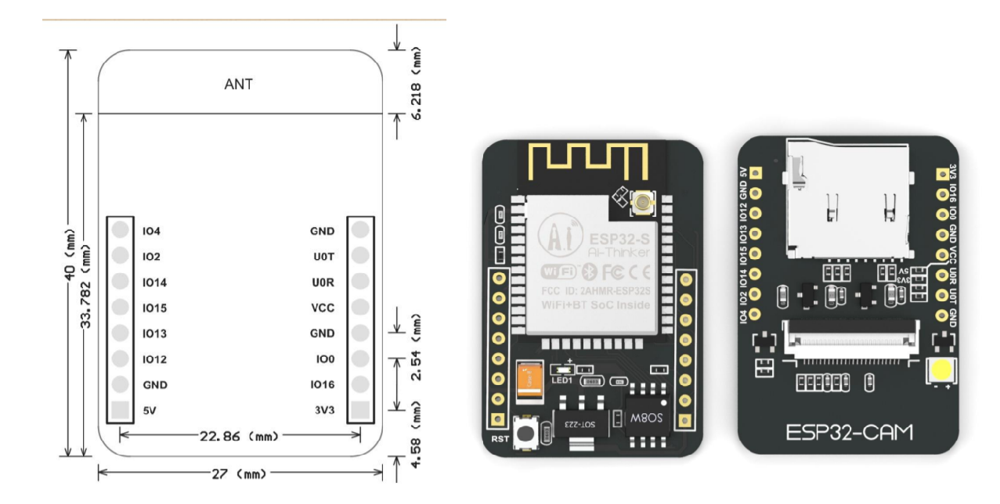

ESP32-CAM是小尺寸的摄像头模组该模块可以作为最小系统独立工作，尺寸仅为 27\*40.5\*4.5mm，可广泛应用于各种物联网场合，适用于家庭智能设备、工业无线控制、无线监控、QR无线识别，无线定位系统信号以及其它物联网应用，是物联网应用的理想解决方案。[\^1]

其产品特性如下：

-   采用低功耗双核32位CPU，可作应用处理器
-   主频高达240MHz，运算能力高达 600 DMIPS
-   内置 520 KB SRAM，外置8MB PSRAM
-   支持UART/SPI/I2C/PWM/ADC/DAC等接口
-   支持OV2640和OV7670摄像头，内置闪光灯
-   支持图片WiFI上传
-   支持TF卡
-   支持多种休眠模式。
-   内嵌Lwip和FreeRTOS
-   支持 STA/AP/STA+AP 工作模式
-   支持 Smart Config/AirKiss 一键配网
-   支持二次开发

ESP32cam 的接口引脚图如下所示：

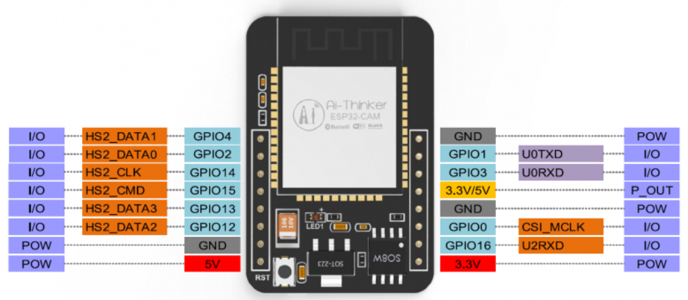

# 2. arduino IDE

## 2.1 安装 arduino IDE

下载官方网址：<https://www.arduino.cc/en/software>  
下载符合自己操作系统版本的IDE并安装。

## 2.2 arduino IDE 获取 ESP32 开发环境

由于 arduino IDE 中本身是没有 ESP32 的开发版，需要手动进行安装，安装方式如下：

1.  打开 Arduino IDE ，找到 文件\>首选项 ,将 ESP32 的配置链接填入附加开发板管理网址中。

\# 配置链接

https://dl.espressif.com/dl/package_esp32_index.json

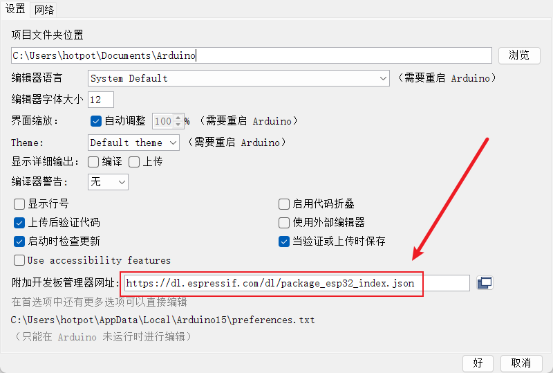

1.  在 Arduino IDE 中，找到 工具\>开发板\>开发板开发板管理，搜索 ESP32 或者直接选择 ESP32 Wrover Module 。  
    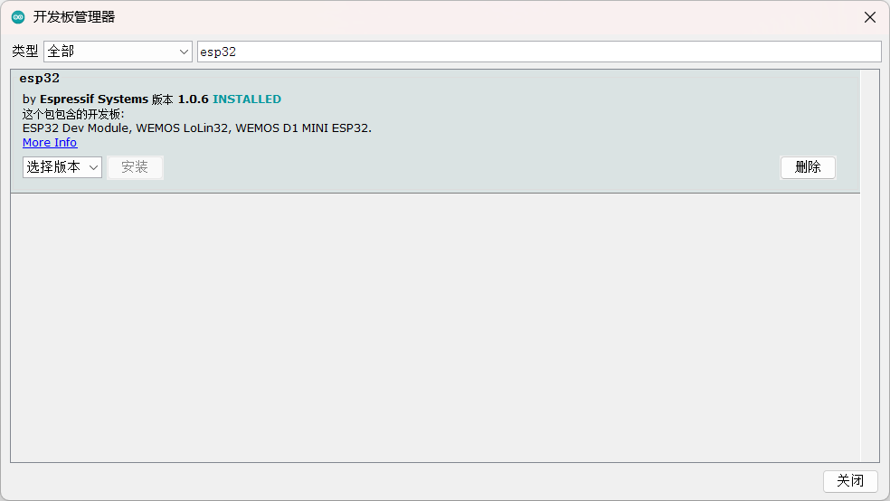

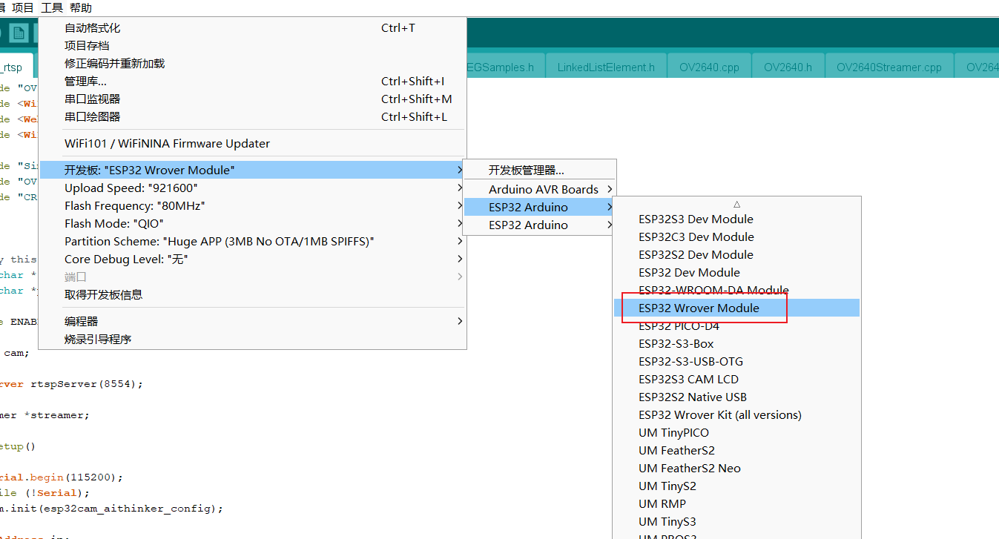

# 3 内网视频实时查看

## 3.1 选择 文件\>示例\>ESP32\>Camera\>CameraWebServer ,进入示例代码界面。

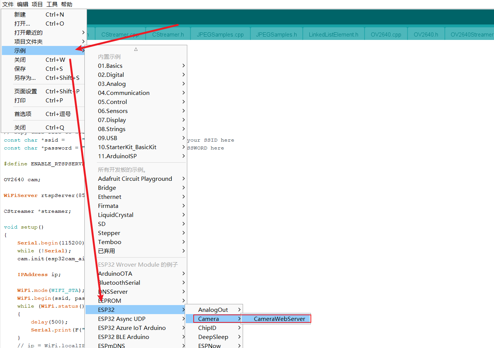

## 3.2 修改示例代码中的相关参数。

1.  修改示例代码中的 wifi 和密码的名称。
2.  修改示例代码中的摄像头类型为 CAMERA_MODEL_AI_THINKER 。

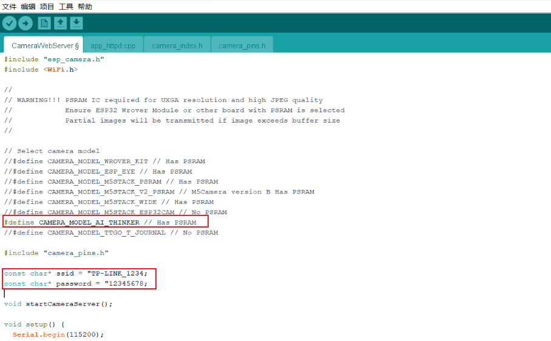

## 3.3 运行结果

上传成功后，按一下 ESP32cam 开发板上的 RST 按键 ，重新启动开发板。  
选择 工具\>串口监视器，查看串口中输出的 ip，并用浏览器打开 ip 即可实时查看视频画面。

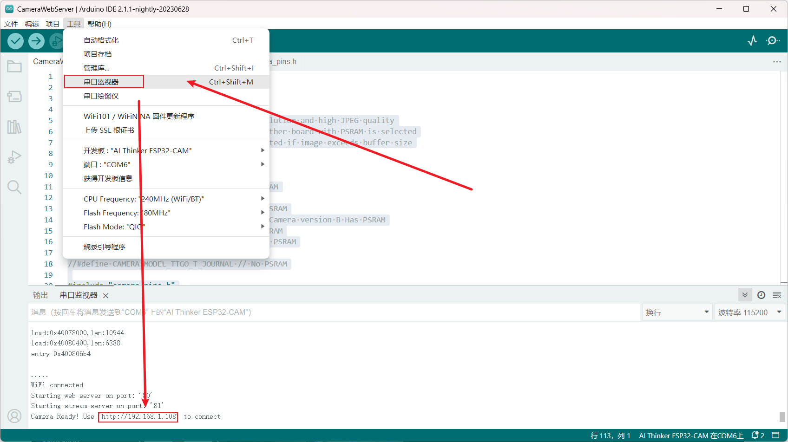

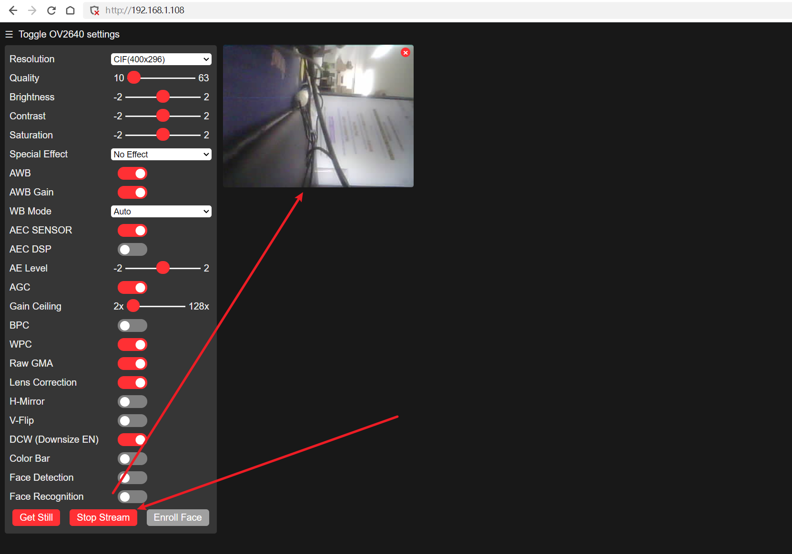

## 3.4 程序如下

    #include "esp_camera.h"
    #include <WiFi.h>

    //
    // WARNING!!! PSRAM IC required for UXGA resolution and high JPEG quality
    //            Ensure ESP32 Wrover Module or other board with PSRAM is selected
    //            Partial images will be transmitted if image exceeds buffer size
    //

    // Select camera model
    // #define CAMERA_MODEL_WROVER_KIT // Has PSRAM
    //#define CAMERA_MODEL_ESP_EYE // Has PSRAM
    //#define CAMERA_MODEL_M5STACK_PSRAM // Has PSRAM
    //#define CAMERA_MODEL_M5STACK_V2_PSRAM // M5Camera version B Has PSRAM
    //#define CAMERA_MODEL_M5STACK_WIDE // Has PSRAM
    //#define CAMERA_MODEL_M5STACK_ESP32CAM // No PSRAM
    #define CAMERA_MODEL_AI_THINKER // Has PSRAM
    //#define CAMERA_MODEL_TTGO_T_JOURNAL // No PSRAM

    #include "camera_pins.h"

    const char* ssid = "TP-LINK_1760";
    const char* password = "987654321";

    void startCameraServer();

    void setup() {
    Serial.begin(115200);
    Serial.setDebugOutput(true);
    Serial.println();

    camera_config_t config;
    config.ledc_channel = LEDC_CHANNEL_0;
    config.ledc_timer = LEDC_TIMER_0;
    config.pin_d0 = Y2_GPIO_NUM;
    config.pin_d1 = Y3_GPIO_NUM;
    config.pin_d2 = Y4_GPIO_NUM;
    config.pin_d3 = Y5_GPIO_NUM;
    config.pin_d4 = Y6_GPIO_NUM;
    config.pin_d5 = Y7_GPIO_NUM;
    config.pin_d6 = Y8_GPIO_NUM;
    config.pin_d7 = Y9_GPIO_NUM;
    config.pin_xclk = XCLK_GPIO_NUM;
    config.pin_pclk = PCLK_GPIO_NUM;
    config.pin_vsync = VSYNC_GPIO_NUM;
    config.pin_href = HREF_GPIO_NUM;
    config.pin_sscb_sda = SIOD_GPIO_NUM;
    config.pin_sscb_scl = SIOC_GPIO_NUM;
    config.pin_pwdn = PWDN_GPIO_NUM;
    config.pin_reset = RESET_GPIO_NUM;
    config.xclk_freq_hz = 20000000;
    config.pixel_format = PIXFORMAT_JPEG;
    
    // if PSRAM IC present, init with UXGA resolution and higher JPEG quality
    //                      for larger pre-allocated frame buffer.
    if(psramFound()){
        config.frame_size = FRAMESIZE_UXGA;
        config.jpeg_quality = 10;
        config.fb_count = 2;
    } else {
        config.frame_size = FRAMESIZE_SVGA;
        config.jpeg_quality = 12;
        config.fb_count = 1;
    }

    #if defined(CAMERA_MODEL_ESP_EYE)
    pinMode(13, INPUT_PULLUP);
    pinMode(14, INPUT_PULLUP);
    #endif

    // camera init
    esp_err_t err = esp_camera_init(&config);
    if (err != ESP_OK) {
        Serial.printf("Camera init failed with error 0x%x", err);
        return;
    }

    sensor_t * s = esp_camera_sensor_get();
    // initial sensors are flipped vertically and colors are a bit saturated
    if (s->id.PID == OV3660_PID) {
        s->set_vflip(s, 1); // flip it back
        s->set_brightness(s, 1); // up the brightness just a bit
        s->set_saturation(s, -2); // lower the saturation
    }
    // drop down frame size for higher initial frame rate
    s->set_framesize(s, FRAMESIZE_QVGA);

    #if defined(CAMERA_MODEL_M5STACK_WIDE) || defined(CAMERA_MODEL_M5STACK_ESP32CAM)
    s->set_vflip(s, 1);
    s->set_hmirror(s, 1);
    #endif

    WiFi.begin(ssid, password);

    while (WiFi.status() != WL_CONNECTED) {
        delay(500);
        Serial.print(".");
    }
    Serial.println("");
    Serial.println("WiFi connected");

    startCameraServer();

    Serial.print("Camera Ready! Use 'http://");
    Serial.print(WiFi.localIP());
    Serial.println("' to connect");
    }

    void loop() {
    // put your main code here, to run repeatedly:
    delay(10000);
    }

# 4 烧录程序到 ESP32cam 开发板中

## 4.1 通过配套的下载器进行下载

1.  将下载器与 ESP32cam 安装到一起，使用数据线链接到电脑，安装商家提供的驱动，之后在 工具选项中选择对应的 开发板与串口。

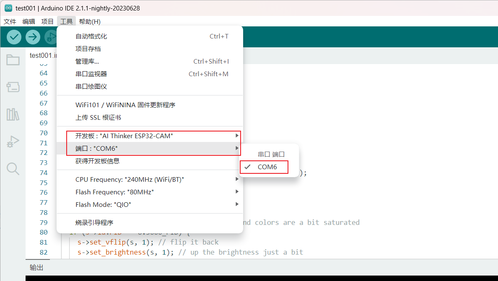

1.  然后点击左上角的**编译验证**按钮进行编译，编译成功后点击旁边的**上传**按钮烧录到 ESP32cam 开发板中。  
    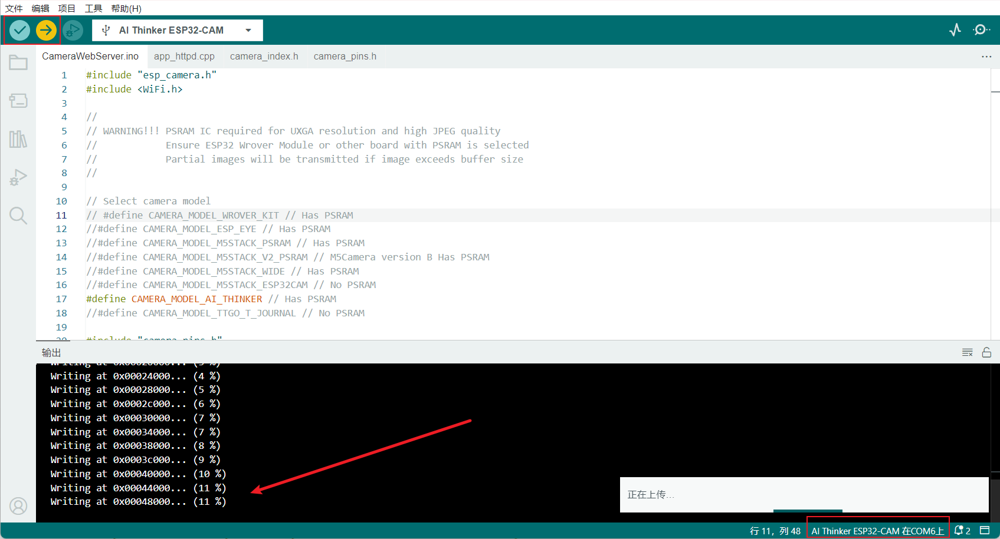

# 5. 外网视频实时查看

外网视频实时查看分为：1. esp32cam 开发板中运行的程序；2. 服务器中运行的程序。  
通过ESP32cam 将视频数据发送的服务器中，服务器运行接受程序进行接收并展示，这样的好处是可以发送到外部公网服务器中。  

esp32cam 中的程序如下：

    #include <Arduino.h>
    #include <WiFi.h>
    #include "esp_camera.h"
    #include <vector>
    
    const char *ssid = "TP-LINK_1760";
    const char *password = "987654321";
    const IPAddress serverIP(192,168,1,104); //欲访问的地址，即服务器的ip，可内网也可公网
    uint16_t serverPort = 18080;         //服务器端口号

    # MTU
    #define maxcache 1430
    
    WiFiClient client; //声明一个客户端对象，用于与服务器进行连接
    
    //CAMERA_MODEL_AI_THINKER类型摄像头的引脚定义
    #define PWDN_GPIO_NUM     32
    #define RESET_GPIO_NUM    -1
    #define XCLK_GPIO_NUM      0
    #define SIOD_GPIO_NUM     26
    #define SIOC_GPIO_NUM     27
    
    #define Y9_GPIO_NUM       35
    #define Y8_GPIO_NUM       34
    #define Y7_GPIO_NUM       39
    #define Y6_GPIO_NUM       36
    #define Y5_GPIO_NUM       21
    #define Y4_GPIO_NUM       19
    #define Y3_GPIO_NUM       18
    #define Y2_GPIO_NUM        5
    #define VSYNC_GPIO_NUM    25
    #define HREF_GPIO_NUM     23
    #define PCLK_GPIO_NUM     22
    
    static camera_config_t camera_config = {
        .pin_pwdn = PWDN_GPIO_NUM,
        .pin_reset = RESET_GPIO_NUM,
        .pin_xclk = XCLK_GPIO_NUM,
        .pin_sscb_sda = SIOD_GPIO_NUM,
        .pin_sscb_scl = SIOC_GPIO_NUM,
        
        .pin_d7 = Y9_GPIO_NUM,
        .pin_d6 = Y8_GPIO_NUM,
        .pin_d5 = Y7_GPIO_NUM,
        .pin_d4 = Y6_GPIO_NUM,
        .pin_d3 = Y5_GPIO_NUM,
        .pin_d2 = Y4_GPIO_NUM,
        .pin_d1 = Y3_GPIO_NUM,
        .pin_d0 = Y2_GPIO_NUM,
        .pin_vsync = VSYNC_GPIO_NUM,
        .pin_href = HREF_GPIO_NUM,
        .pin_pclk = PCLK_GPIO_NUM,
        
        .xclk_freq_hz = 20000000,
        .ledc_timer = LEDC_TIMER_0,
        .ledc_channel = LEDC_CHANNEL_0,
        
        .pixel_format = PIXFORMAT_JPEG,
        // .frame_size = FRAMESIZE_VGA,
        // FRAMESIZE_UXGA (1600 x 1200)
        // FRAMESIZE_QVGA (320 x 240)
        // FRAMESIZE_CIF (352 x 288)
        // FRAMESIZE_VGA (640 x 480)
        // FRAMESIZE_SVGA (800 x 600)
        // FRAMESIZE_XGA (1024 x 768)
        // FRAMESIZE_SXGA (1280 x 1024)
        .frame_size = FRAMESIZE_QVGA,
        .jpeg_quality = 24,
        // 图像质量（jpeg_quality) 可以是 0 到 63 之间的数字。数字越小意味着质量越高
        .fb_count = 1,
    };
    void wifi_init()
    {
        WiFi.mode(WIFI_STA);
        WiFi.setSleep(false); //关闭STA模式下wifi休眠，提高响应速度
        WiFi.begin(ssid, password);
        while (WiFi.status() != WL_CONNECTED)
        {
            delay(500);
            Serial.print(".");
        }
        Serial.println("WiFi Connected!");
        Serial.print("IP Address:");
        Serial.println(WiFi.localIP());
    }
    esp_err_t camera_init() {
        //initialize the camera
        esp_err_t err = esp_camera_init(&camera_config);
        if (err != ESP_OK) {
            Serial.println("Camera Init Failed");
            return err;
        }
        sensor_t * s = esp_camera_sensor_get();
        //initial sensors are flipped vertically and colors are a bit saturated
        if (s->id.PID == OV2640_PID) {
        //        s->set_vflip(s, 1);//flip it back
        //        s->set_brightness(s, 1);//up the blightness just a bit
        //        s->set_contrast(s, 1);
        }
        Serial.println("Camera Init OK!");
        return ESP_OK;
    }
    
    void setup()
    {
        Serial.begin(115200);
        wifi_init();
        camera_init();
    }
    
    void loop()
    {
        Serial.println("Try To Connect TCP Server!");
        if (client.connect(serverIP, serverPort)) //尝试访问目标地址
        {
            Serial.println("Connect Tcp Server Success!");
            //client.println("Frame Begin");  //46 72 61 6D 65 20 42 65 67 69 6E // 0D 0A 代表换行  //向服务器发送数据
            while (1){       
            camera_fb_t * fb = esp_camera_fb_get();
            uint8_t * temp = fb->buf; //这个是为了保存一个地址，在摄像头数据发送完毕后需要返回，否则会出现板子发送一段时间后自动重启，不断重复
            if (!fb)
            {
                Serial.println( "Camera Capture Failed");
            }
            else
            { 
                //先发送Frame Begin 表示开始发送图片 然后将图片数据分包发送 每次发送1430 余数最后发送 
                //完毕后发送结束标志 Frame Over 表示一张图片发送完毕 
                client.print("Frame Begin"); //一张图片的起始标志
                // 将图片数据分段发送
                int leng = fb->len;
                int timess = leng/maxcache;
                int extra = leng%maxcache;
                for(int j = 0;j< timess;j++)
                {
                client.write(fb->buf, maxcache); 
                for(int i =0;i< maxcache;i++)
                {
                    fb->buf++;
                }
                }
                client.write(fb->buf, extra);
                client.print("Frame Over");      // 一张图片的结束标志
                Serial.print("This Frame Length:");
                Serial.print(fb->len);
                Serial.println(".Succes To Send Image For TCP!");
                //return the frame buffer back to the driver for reuse
                fb->buf = temp; //将当时保存的指针重新返还
                esp_camera_fb_return(fb);  //这一步在发送完毕后要执行，具体作用还未可知。        
            }
            delay(20);//短暂延时 增加数据传输可靠性
            }
            /*
            while (client.connected() || client.available()) //如果已连接或有收到的未读取的数据
            {
                if (client.available()) //如果有数据可读取
                {
                    String line = client.readStringUntil('\n'); //读取数据到换行符
                    Serial.print("ReceiveData：");
                    Serial.println(line);
                    client.print("--From ESP32--:Hello Server!");    
                }
            }
            Serial.println("close connect!");
            client.stop(); //关闭客户端
            */
        }
        else
        {
            Serial.println("Connect To Tcp Server Failed!After 10 Seconds Try Again!");
            client.stop(); //关闭客户端
        }
        delay(10000);
    }

服务器中运行的程序（Python）:

    import socket
    import threading
    import time
    import numpy as np
    import cv2
    
    begin_data = b'Frame Begin'
    end_data = b'Frame Over'
    
    #接收数据
    # ESP32发送一张照片的流程
    # 先发送Frame Begin 表示开始发送图片 然后将图片数据分包发送 每次发送1430 余数最后发送
    # 完毕后发送结束标志 Frame Over 表示一张图片发送完毕
    # 1430 来自ESP32cam发送的一个包大小为1430 接收到数据 data格式为b''
    def handle_sock(sock, addr):
        temp_data = b''
        t1 = int(round(time.time() * 1000))
        while True:
            data = sock.recv(1430)
            # 如果这一帧数据包的开头是 b'Frame Begin' 则是一张图片的开始
            if data[0:len(begin_data)] == begin_data:
                # 将这一帧数据包的开始标志信息（b'Frame Begin'）清除   因为他不属于图片数据
                data = data[len(begin_data):len(data)]
                # 判断这一帧数据流是不是最后一个帧 最后一针数据的结尾时b'Frame Over'
                while data[-len(end_data):] != end_data:
                    temp_data = temp_data + data  # 不是结束的包 讲数据添加进temp_data
                    data = sock.recv(1430)# 继续接受数据 直到接受的数据包包含b'Frame Over' 表示是这张图片的最后一针
                # 判断为最后一个包 将数据去除 结束标志信息 b'Frame Over'
                temp_data = temp_data + data[0:(len(data) - len(end_data))]  # 将多余的（\r\nFrame Over）去掉 其他放入temp_data
                # 显示图片
                receive_data = np.frombuffer(temp_data, dtype='uint8')  # 将获取到的字符流数据转换成1维数组
                r_img = cv2.imdecode(receive_data, cv2.IMREAD_COLOR)  # 将数组解码成图像
                # r_img = r_img.reshape(480, 640, 3)
                # r_img = r_img.reshape(320, 240, 3)
                t2 = int(round(time.time() * 1000))
                fps = 1000//(t2-t1)
                cv2.putText(r_img, "FPS" + str(fps), (50, 50), cv2.FONT_HERSHEY_SIMPLEX, 1, (255, 0, 0), 2)
                cv2.imshow('server_frame', r_img)
                if cv2.waitKey(1) & 0xFF == ord('q'):
                    break
                t1 = t2
                print("接收到的数据包大小：" + str(len(temp_data)))  # 显示该张照片数据大小
                temp_data = b''  # 清空数据 便于下一章照片使用
    
    server = socket.socket(socket.AF_INET, socket.SOCK_STREAM)

    # 这里的 ip 与端口是运行该程序的服务器的 ip 与端口，需要与 arduino 中的一致
    server.bind(('192.168.1.104', 18080))
    server.listen(5)
    CONNECTION_LIST = []
    
    #主线程循环接收客户端连接
    while True:
        sock, addr = server.accept()
        CONNECTION_LIST.append(sock)
        print('Connect--{}'.format(addr))
        #连接成功后开一个线程用于处理客户端
        client_thread = threading.Thread(target=handle_sock, args=(sock, addr))
        client_thread.start()

