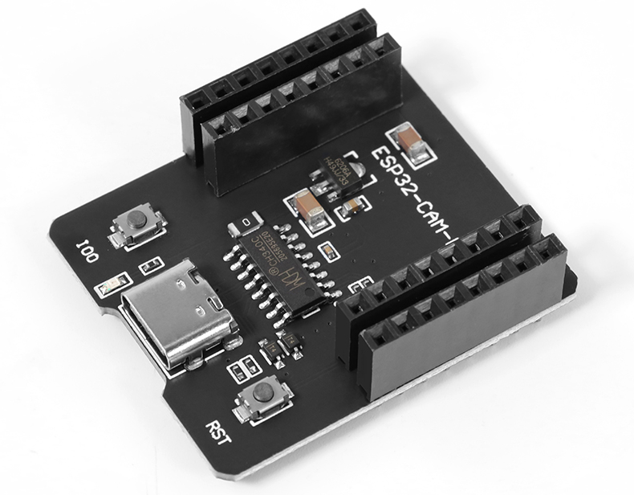
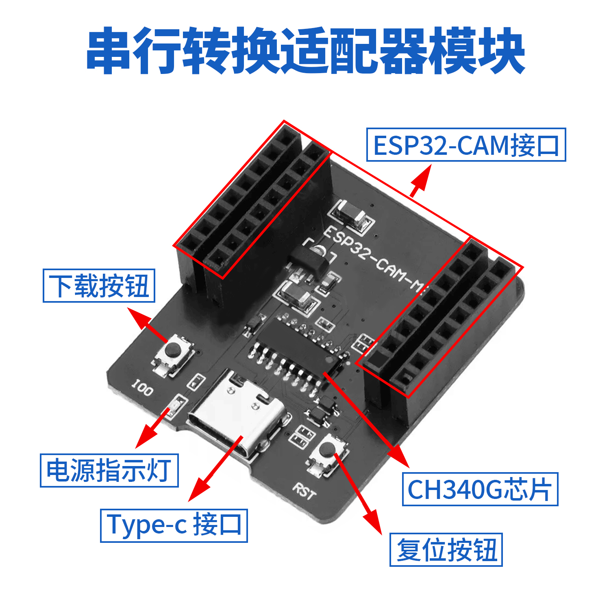
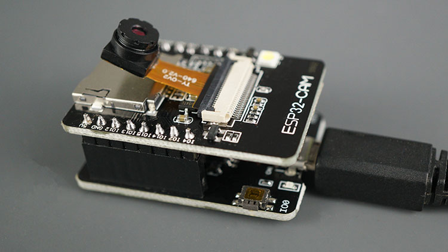
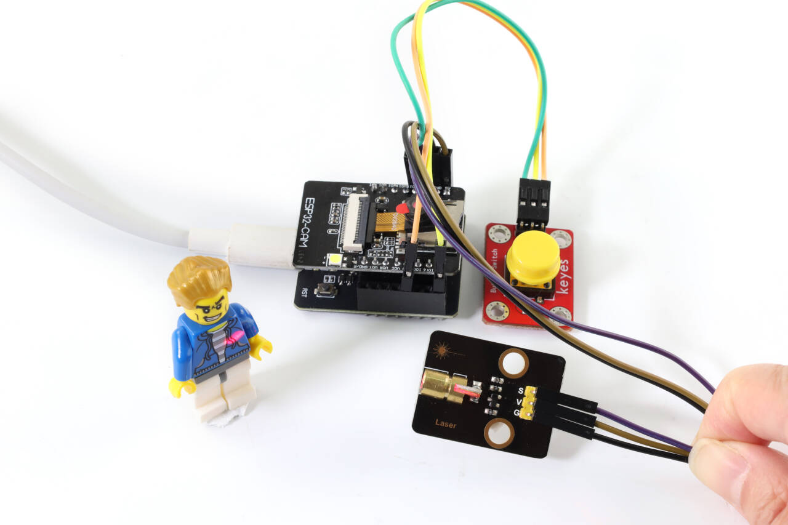
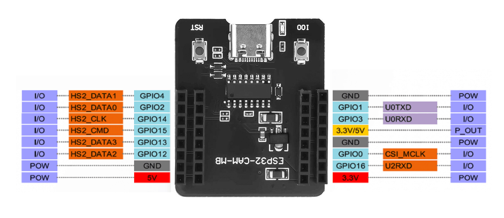

# ESP32-CAM 开发板扩展底板

  

## 一、说明
ESP32-CAM开发板扩展底座是专为ESP32-CAM设计的配件，旨在优化和简化物联网应用的开发。该底座为ESP32-CAM提供了稳定的电源管理和多种连接接口，使开发者能够方便地进行原型搭建和应用开发。它结合了ESP32-CAM的强大功能，广泛应用于智能家居、工业控制、无线监控和其他物联网场景。

## 二、特点
1. **高兼容性**：专为ESP32-CAM设计，适配广泛的开发环境。
2. **稳定供电**：内置高效稳压模块，确保系统在各种工况下稳定工作。
3. **扩展性强**：提供多种GPIO接口，支持各类传感器和其他外部模块的连接。
4. **简便易用**：用户可直接将ESP32-CAM开发板插入底板使用，快速部署项目。

## 三、参数
| 参数        | 描述                    |
|-------------|-----------------------|
| 工作电压    | 5V（通过USB或电池供电） |
| 供电电流    | 最高500mA             |
| GPIO引脚数量| 6个可用引脚           |
| 材料        | PCB（印刷电路板）     |
| 兼容模块    | OV2640、OV7670摄像头   |
| 重量        | 约50克                |

  

## 四、使用方法

1. **硬件连接**：
   - 将ESP32-CAM模块正确插入在扩展底座上，确保各接口对齐。
   

2. **供电**：
   - 通过USB线将扩展底座连接到电源适配器，或使用电池供电。
   

3. **外设连接**：
   - 利用扩展底座上的GPIO接口，连接各种传感器和其他模块，以实现项目的功能扩展。
   

4. **安装 CH340 芯片驱动**：
   - **下载驱动程序**：访问 [CH340 驱动下载页面](http://www.wch.cn/downloads/CH341SER_ZIP.html)，下载并解压驱动文件。
   - **安装驱动**：双击解压后的安装文件，按照提示完成驱动的安装。
   - **重启计算机**：安装完成后，重启计算机确保驱动生效。
   - **连接设备**：重启后，将ESP32-CAM扩展底座通过USB连接到计算机，系统会自动识别新硬件。

5. **注意事项**：
   - 确保模块输入电源至少为5V 2A，以避免图像出现水纹。
   - ESP32 GPIO32管脚控制摄像头电源，当摄像头工作时，请将GPIO32拉低。

## 五、ESP32-CAM 开发板扩展底座 Pinout

| 引脚      | 描述            |
|-----------|-----------------|
| IO0       | 引导引脚        |
| IO1       | U0TXD           |
| IO2       | GPIO2           |
| IO3       | U0RXD           |
| IO4       | GPIO4           |
| IO12      | GPIO12          |
| IO13      | GPIO13          |
| IO14      | GPIO14          |
| IO15      | GPIO15          |
| IO16      | GPIO16          |
| 5V        | 电源输入        |
| GND       | 地              |
| 3.3V      | 3.3V 输出       |
| POW       | 电源引脚        |

   

### 结论

ESP32-CAM开发板扩展底座是一个强大的开发工具，为使用ESP32-CAM的项目提供了极大的便利和扩展性。无论是在学习、实验还是实际应用中，扩展底座都能帮助工程师和开发者提升项目的能力和性能。
