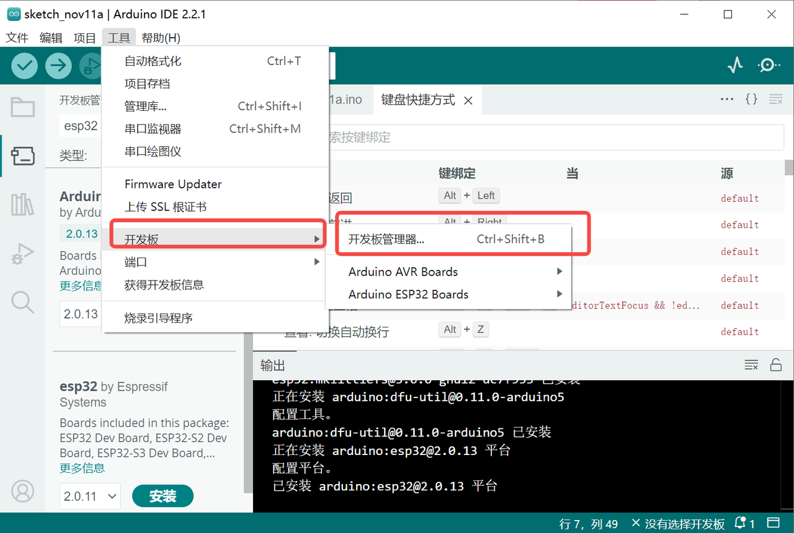
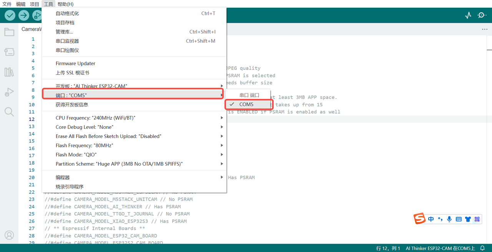

# Wifi摄像头模块ESP32-CAM配置教程

## 1.简介

ESP32-CAM是一个小巧但功能强大的摄像头模块，非常适合DIY爱好者和科创项目。它可以连接Wi-Fi和蓝牙，让你轻松地进行图像捕获和视频流处理。无论你是想做一个智能小车，还是想在家里安装一个简易的监控系统，ESP32-CAM都是一个很好的选择。

网上有多种配置教程，下文简单介绍一种配置ESP32-CAM的方式以及简单应用【注：不同配置方式涉及的库及使用方法会略有不同】。

## 2.简单使用教程

### 第一步：准备硬件

a.在平台购买ESP32-CAM，ESP32-CAM底板。

b.核对规格：确保购买的是ESP32-CAM模块，它通常包括一个小型摄像头模块（摄像头模块可能需要自行安装）。

c.USB接口的线，配合ESP32-CAM连接。

注：不同型号的配置方式也可能有所不同，本教程适用的ESP32-CAM如下图所示。


### 第二步：准备编程环境

a.下载并安装arduino IDE

这是一个编程软件，可以让你给ESP32-CAM编写和上传代码。

下载地址：[https://www.arduino.cc/en/Main/Software?setlang=cn](https://www.arduino.cc/en/Main/Software?setlang=cn)

b.下载完成后打开arduino IDE选择首选项


打开配置后，添加附加开发板管理器网址（可直接复制下面的网址）

```
https://dl.espressif.com/dl/package_esp32_index.json
http://arduino.esp8266.com/stable/package_esp8266com_index.json
```


c.打开工具-开发板管理器，然后搜索esp32



选第二个esp32 by Espressif点击安装，等待安装完毕


如因网速原因安装较慢可使用离线方法，相关文件和安装方法已上传百度云盘。

链接：[https://pan.baidu.com/s/1T2vqBC2903NnPU-Cv-Qolw](https://pan.baidu.com/s/1T2vqBC2903NnPU-Cv-Qolw)
提取码：bpri 

### 第三步：连接ESP32-CAM至电脑

将ESP32-CAM模块通过转换器连接到电脑，并在arduino ide中选择连接，工具-开发板-ESP32-esp32 Wrover Module【上一步顺利完成此步骤才会出现此选项】


工具-端口选择COM5，如果无法识别，可能需要安装对应的COM驱动，如[CH341SER.EXE](https://www.wch.cn/downloads/CH341SER_EXE.html)。



### 第四步：编写配置WIFI的代码

a.获取编程示例

ESP32 CAM Live Video Streaming in Python OpenCV的示例代码是：

```
#include <WebServer.h>
#include <WiFi.h>
#include <esp32cam.h>
 
const char* WIFI_SSID = "请写入你的WIFI账号"; 
const char* WIFI_PASS = "请写入你的WIFI密码";
 
WebServer server(80);
 
 
static auto loRes = esp32cam::Resolution::find(320, 240);
static auto midRes = esp32cam::Resolution::find(350, 530);
static auto hiRes = esp32cam::Resolution::find(800, 600);
void serveJpg()
{
  auto frame = esp32cam::capture();
  if (frame == nullptr) {
    Serial.println("CAPTURE FAIL");
    server.send(503, "", "");
    return;
  }
  Serial.printf("CAPTURE OK %dx%d %db\n", frame->getWidth(), frame->getHeight(),
                static_cast<int>(frame->size()));
 
  server.setContentLength(frame->size());
  server.send(200, "image/jpeg");
  WiFiClient client = server.client();
  frame->writeTo(client);
}
 
void handleJpgLo()
{
  if (!esp32cam::Camera.changeResolution(loRes)) {
    Serial.println("SET-LO-RES FAIL");
  }
  serveJpg();
}
 
void handleJpgHi()
{
  if (!esp32cam::Camera.changeResolution(hiRes)) {
    Serial.println("SET-HI-RES FAIL");
  }
  serveJpg();
}
 
void handleJpgMid()
{
  if (!esp32cam::Camera.changeResolution(midRes)) {
    Serial.println("SET-MID-RES FAIL");
  }
  serveJpg();
}
 
 
void  setup(){
  Serial.begin(115200);
  Serial.println();
  {
    using namespace esp32cam;
    Config cfg;
    cfg.setPins(pins::AiThinker);
    cfg.setResolution(hiRes);
    cfg.setBufferCount(2);
    cfg.setJpeg(80);
 
    bool ok = Camera.begin(cfg);
    Serial.println(ok ? "CAMERA OK" : "CAMERA FAIL");
  }
  WiFi.persistent(false);
  WiFi.mode(WIFI_STA);
  WiFi.begin(WIFI_SSID, WIFI_PASS);
  while (WiFi.status() != WL_CONNECTED) {
    delay(500);
  }
  Serial.print("http://");
  Serial.println(WiFi.localIP());
  Serial.println("  /cam-lo.jpg");
  Serial.println("  /cam-hi.jpg");
  Serial.println("  /cam-mid.jpg");
 
  server.on("/cam-lo.jpg", handleJpgLo);
  server.on("/cam-hi.jpg", handleJpgHi);
  server.on("/cam-mid.jpg", handleJpgMid);
 
  server.begin();
}
 
void loop()
{
  server.handleClient();
}
```

b.新建文件，将上述代码复制到新文件中，编写Wi-Fi代码，包括指定Wi-Fi账号和密码（第五、六行代码WIFI_SSID和WIFI_PASS），其他不变。【注意：此时先不要上传代码】

### 第五步：安装esp32cam库

a.下载esp32cam库

下载地址：[https://github.com/yoursunny/esp32cam](https://github.com/yoursunny/esp32cam)


b.导入库

项目-导入库-添加.ZIP库


### 第六步：上传代码并获取IP地址

单击上传按钮上传代码


上传代码后点击esp32cam的reset键，重启esp32cam，可打开串口监视器，查看上传代码的运行情况(示例代码会输出相关ip和路径)


下图中是串口监视器里输出的结果（如没有输出可增大默认的波特率）


可以发现在串行监视器的IP地址下，会看到三种不同的图像分辨率 lo、hi 和 mid，根据需求使用一个。

例如我们可以使用http://192.168.31.75/240x240.jpg，使用浏览器打开即可看到摄像头拍摄的照片，手动刷新可以看到拍摄到的一张张照片。

